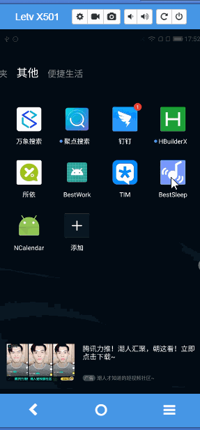

"# Audio"


### **BestSleep**

#### 启动页
- 采用 SVG获取图片Path 生成动态效果
#### 登录，注册，忘记密码
- 适配小屏幕手机，键盘弹起界面跟随做出变化
```
 mScrollView.addOnLayoutChangeListener(new ViewGroup.OnLayoutChangeListener() {
            @Override
            public void onLayoutChange(View v, int left, int top, int right, int bottom, int oldLeft, int oldTop, int oldRight, int oldBottom) {
              /* old是改变前的左上右下坐标点值，没有old的是改变后的左上右下坐标点值
              现在认为只要控件将Activity向上推的高度超过了1/3屏幕高，就认为软键盘弹起*/
                if (oldBottom != 0 && bottom != 0 && (oldBottom - bottom > keyHeight)) {
                    Log.e("wenzhihao", "up------>" + (oldBottom - bottom));
                    int dist = mContent.getBottom() - bottom;
                    if (dist > 0) {
                        ObjectAnimator mAnimatorTranslateY = ObjectAnimator.ofFloat(mContent, "translationY", 0.0f, -dist);
                        mAnimatorTranslateY.setDuration(300);
                        mAnimatorTranslateY.setInterpolator(new LinearInterpolator());
                        mAnimatorTranslateY.start();
                        RxAnimationTool.zoomIn(mLogo, 0.6f, dist);
                    }
                    mService.setVisibility(View.INVISIBLE);

                } else if (oldBottom != 0 && bottom != 0 && (bottom - oldBottom > keyHeight)) {
                    Log.e("wenzhihao", "down------>" + (bottom - oldBottom));
                    if ((mContent.getBottom() - oldBottom) > 0) {
                        ObjectAnimator mAnimatorTranslateY = ObjectAnimator.ofFloat(mContent, "translationY", mContent.getTranslationY(), 0);
                        mAnimatorTranslateY.setDuration(300);
                        mAnimatorTranslateY.setInterpolator(new LinearInterpolator());
                        mAnimatorTranslateY.start();
                        //键盘收回后，logo恢复原来大小，位置同样回到初始位置
                        RxAnimationTool.zoomOut(mLogo, 0.6f);
                    }
                    mService.setVisibility(View.VISIBLE);
                }
            }
        });
```
- 注册及忘记密码界面采用dialog 形式弹出，以封装Dialog类，方便使用 ``` BaseCustonDialogFragment.java ```
- 账号采用GreenDao数据库，进行账号的增，删，改，查。
- 数据库升级需要修改
```
greendao {
    schemaVersion 2 //每次升级需要自增
    daoPackage 'com.ping.greendao.gen'
    targetGenDir 'src/main/java'
}
```
#### 音波分贝
- 声音转分贝公式
- 
 

- 具体代码实现

```  
平方和除以数据总长度，得到音量大小。
double mean = v / (double) readSize;
double volume = 10 * Math.log10(mean);
```
- 分贝显示 ``` compass_servant.setPointerDecibel(value); ```采用开源控件 * CompassServant

- 音波显示 采用开源控件 * AudioWaveView

- 代码算法打鼾检测
- 1.


```

 /**
         * 打鼾状态检测，一秒轮循检测，监测机制
         * 大于60分贝的话记录，一秒内超过某分贝即为打鼾(一秒内记录值大约为20次，超过一定次，低于限制次即为打鼾，否则为其他状态)
         *
         */
        subscribe = Observable.interval(1, TimeUnit.SECONDS).subscribe(new Consumer<Long>() {
            @Override
            public void accept(Long aLong) throws Exception {
                if (integerList.size() > 0) {
                    count = 0;
                    countQuick = 0;
                    Observable.fromIterable(integerList).subscribe(new Consumer<Integer>() {
                        @Override
                        public void accept(Integer integer) throws Exception {
                            if (integer > 60) {
                                count += integer;
                            }
                            countQuick += integer;
                        }
                    }, new Consumer<Throwable>() {
                        @Override
                        public void accept(Throwable throwable) throws Exception {

                        }
                    });
                    Log.e("一秒数据", Arrays.toString(integerList.toArray()));
                    int i = count / 3;
                    int iQuick = countQuick / integerList.size();
                    if (i > 60) {
                        countList.add(i);
                    }
                    if (isStartVibrate && iQuick > 60 && iQuick < 70) {
                        countSnoring.add(iQuick);
                        RxVibrateTool.vibrateOnce(MainActivity.this, 300);
                    }
                    integerList.clear();
                }
            }
        });
```
- 2. 

```
 /**
         * 检测是否处于打鼾状态
         */
        subscribe1 = Observable.interval(10, TimeUnit.SECONDS).subscribe(new Consumer<Long>() {
            @Override
            public void accept(Long aLong) throws Exception {
                /**
                 *
                 */
                if (5 <= countList.size()) {
                    isStartVibrate = true;
                    countSnoring.add(countList.size());
                    RxVibrateTool.vibrateOnce(MainActivity.this, 1000);
                    countList.clear();
                } else {
                    isStartVibrate = false;
                }
            }
        });
```

- 3.
```

   /**
         * 开启超时检测打鼾，一分钟后  一定时间内开启，否则关闭打鼾状态
         */
        subscribe2 = Observable.timer(1, TimeUnit.MINUTES)
                .subscribeOn(Schedulers.io())
                .observeOn(AndroidScheduler.mainThread())
                .subscribe(new Consumer<Long>() {
                    @Override
                    public void accept(Long aLong) throws Exception {
                        isStartVibrate = false;
                    }
                }, new Consumer<Throwable>() {
                    @Override
                    public void accept(Throwable throwable) throws Exception {

                    }
                });

```

#### 睡眠记录

- 数据库记录每日睡眠状况
- 当日数据通过Dialog 弹窗显示

```
  CurrentRecordDialog dialog = new CurrentRecordDialog();
   Bundle arguments = new Bundle();
   arguments.putParcelable("record", recordBean);
   dialog.setArguments(arguments);
   dialog.show(getSupportFragmentManager(), "current");
```
- 记录分析健康报告（包含睡眠时间，打鼾次数等...）
- 日历形式选择查看某日记录,（绿点显示何日记录睡眠状态）采用开源框架* ncalendar
 
#### 精准投放
- 封装WebView 实现可加载网页
- 
```
//只需要在入口更改连接就可以
 Intent intent = new Intent(this, ActivityWebView.class);
Bundle value = new Bundle();
value.putString("url", "http://www.baidu.com");
intent.putExtra("bundle", value);
startActivity(intent);
```

#### 其他

- 关于Android 6.0 权限动态申请问题

```
//解决申请权限
AndPermission.with(this)
                .permission(Permission.WRITE_EXTERNAL_STORAGE, Permission.RECORD_AUDIO)
                .onGranted(new Action() {
                    @Override
                    public void onAction(List<String> permissions) {
                    }
                })
                .onDenied(new Action() {
                    @Override
                    public void onAction(@NonNull List<String> permissions) {
                        AndPermission.hasAlwaysDeniedPermission(MainActivity.this, permissions);
                    }
                })
                .start();
```
- 关于Android 7.0 FileProvider 文件权限问题

```

if (Build.VERSION.SDK_INT >= Build.VERSION_CODES.N) {
            StrictMode.VmPolicy.Builder builder = new StrictMode.VmPolicy.Builder();
            StrictMode.setVmPolicy(builder.build());
        }

```
